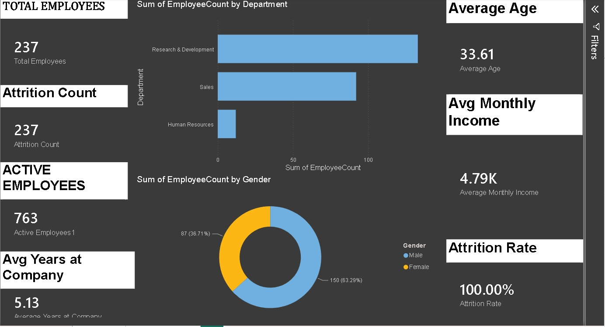
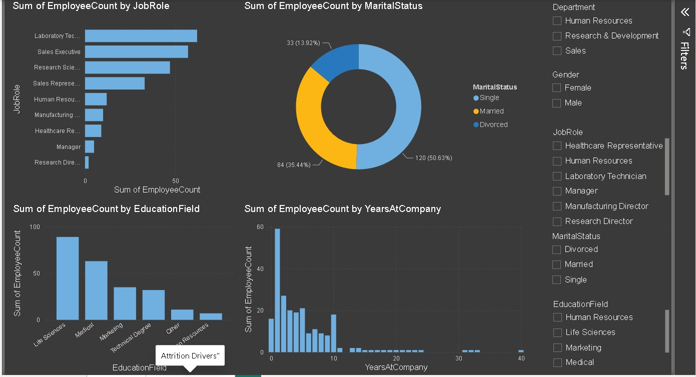

# HR Employee Attrition Analysis Dashboard

## 📌 Project Overview

This project analyses employee attrition using Power BI. The dashboard helps HR teams understand employee turnover, workforce distribution, salary trends, and key HR metrics.

## 📸 Dashboard Preview

### Overview Dashboard

### Attrition Drivers Dashboard

## 🛠️ Tools Used

- Power BI
- SQL
- Microsoft Excel
- DAX

## 📊 Key KPIs

- Total Employees
- Active Employees
- Attrition Count
- Attrition Rate
- Average Age
- Average Monthly Income
- Average Years at Company

## 📈 Key Insights

- Research & Development has the highest number of employees.
- Sales is the second-largest department.
- Male employees outnumber female employees.
- The average employee age is approximately 34 years.
- The average monthly income is around 4.79K.

## 🎯 Objective

To analyze employee attrition trends and provide actionable insights that support HR decision-making.
